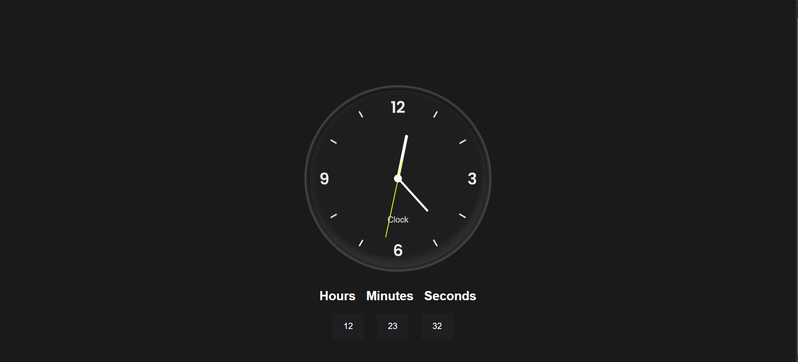

# 🕒 Clock with HTML, CSS & JavaScript

A clean, responsive analog and digital clock built with vanilla HTML, CSS, and JavaScript.

---

## 📁 Project Structure

```

Clock-with-Html-CSS-JavaScript/
├── index.html
├── style.css
├── clock_light.png
├── clock_dark.png
├── preview.JPG  
└── README.md

````

---

## 🖼️ Preview



---

## 🚀 How to Run It

1. Open `index.html` in any modern web browser.

---

## 🛠️ Features & Concepts Covered

* ✅ Real-time analog clock with smooth ticking hands
* ✅ Digital time display (12‑hour or 24‑hour format)
* ✅ CSS transforms and transitions for rotating clock hands
* ✅ DOM manipulation via `document.querySelector()`
* ✅ Time updates using `setInterval()` and the `Date` object
* ✅ Responsive design and centered layout

---

## 📺 Video Tutorial

[](https://youtu.be/sPV55iXFjSk)


---

## 🤝 Contributing

Contributions welcome! Fork the repo, make enhancements or fixes, and open a pull request.

---

## 📜 License

This project is released under the **MIT License**—free to use, modify, and share with attribution.

---

**Made with ❤️ by [trexplains](https://github.com/trexplains/academy)**
